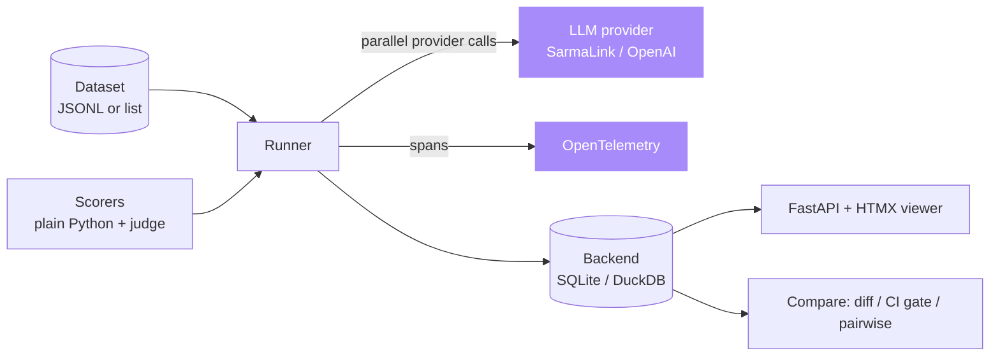
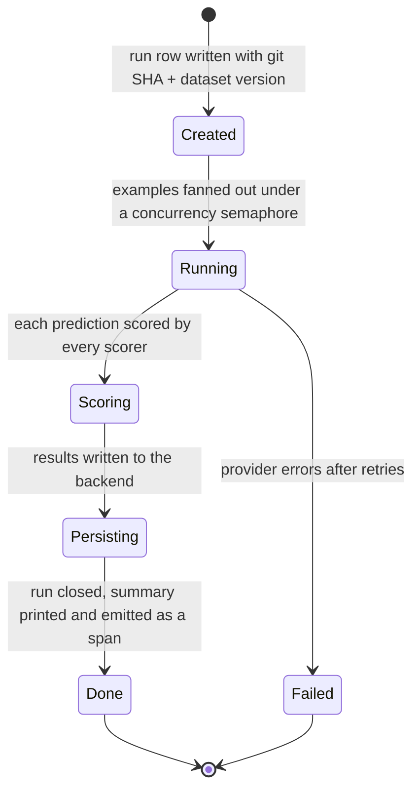

# Architecture

ai-eval-runner is a small Python library and CLI built around one idea: an eval
run is a function over a dataset, scored by plain Python, persisted by git SHA
and dataset version so two runs are only compared when they are genuinely
comparable.

## Components

| Module | Responsibility |
|---|---|
| `aieval/cli.py` | Typer CLI: `run`, `list`, `view`, `diff`, `ci`, `pairwise` |
| `aieval/core/runner.py` | Parallel execution with retry, scoring, telemetry, storage; records git SHA and dataset version |
| `aieval/core/dataset.py` | JSONL and in-process loaders, content `version()`, and `DatasetRegistry` |
| `aieval/core/scorer.py` | The `@scorer` decorator, scorer naming, and `invoke_scorer` context injection |
| `aieval/core/regression.py` | `compare()` for per-scorer deltas and per-example diffs; the CI gate uses it |
| `aieval/core/pairwise.py` | Paired bootstrap A/B with percentile confidence intervals |
| `aieval/core/telemetry.py` | OpenTelemetry span and attribute capture, with a no-op fallback |
| `aieval/scorers/*.py` | Built-in scorers: exact match, JSON validity, ROUGE-L, and `llm_judge` |
| `aieval/backends/*.py` | SQLite and DuckDB result stores, both file-based |
| `aieval/providers/*.py` | SarmaLink and OpenAI-compatible adapters |
| `aieval/viewer/app.py` | FastAPI plus HTMX run browser and regression diff view |

## Run lifecycle

## Design decisions

**Plain Python scorers** rather than a DSL. You get IDE support, real
debuggers, and no leaky abstraction between what you want to measure and how you
express it. A scorer is any callable returning a float in 0.0 to 1.0. Scorers
that need more signal declare `example`, `model`, `provider` or `prompt`
parameters and the runner fills them via `invoke_scorer`. This is what lets the
LLM judge see the original request without changing the common two argument
case.

**Versioning by git SHA plus dataset content version** so two runs are only
comparable when both the code and the data match. The dataset version is an
order-independent SHA-256 over the canonical JSON of every row, so reordering
rows does not invalidate a comparison but editing a row does. The
`DatasetRegistry` records each distinct version under a name so dataset drift is
auditable.

**Paired bootstrap for A/B** rather than a single point estimate. Resampling
the per-example differences with replacement and taking a percentile interval
tells you whether B genuinely beats A or whether the data cannot support the
claim. It is pure Python with a seedable generator, so it is reproducible and
adds no numeric dependency.

**OpenTelemetry behind an optional extra**. The runner emits a span per run and
per example with GenAI semantic attributes when the API is installed, and
degrades to a no-op recorder otherwise. Call sites are identical in both modes,
and the captured attribute dict doubles as the unit tests inspect.

**SQLite by default, DuckDB for analytics**, both file-based so there is no
server to stand up. Set `AIEVAL_BACKEND` and `AIEVAL_DB_PATH` to switch.

**HTMX viewer** rather than a single-page app because the viewer is a read-only
inspection tool. HTML over the wire is faster to build and easier to embed.
