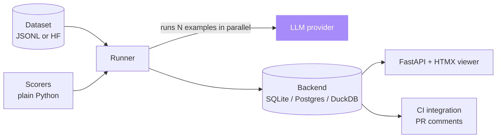

# ai-eval-runner

[](https://opensource.org/licenses/MIT)
[](https://python.org)
[](https://duckdb.org)
[](https://fastapi.tiangolo.com)
[](https://github.com/sarmakska/ai-eval-runner)

**Evals as code. Datasets, scorers, traces, regressions, all in one CLI.**

Built by [Sarma Linux](https://sarmalinux.com).

---

## Why evals as code

LLM evaluation in 2026 is non-negotiable. If you ship a prompt change without an eval suite you are guessing. Most eval tools are either heavyweight platforms with vendor lock-in or thin wrappers that score one example at a time. This runner is the middle path.

- **Datasets** as JSONL or HuggingFace
- **Scorers** as plain Python functions: built-in LLM-as-judge, exact-match, BLEU, ROUGE, JSON schema validity, rubric grading
- **Runs** versioned by git SHA plus dataset hash
- **Outputs** to local SQLite or Postgres
- **Traces** visualised in a built-in HTMX viewer
- **CI integration** that fails the build on regression deltas above threshold

Treat prompts as software with the same rigour as backend code.

## Architecture



## Quick start

```bash
git clone https://github.com/sarmakska/ai-eval-runner.git
cd ai-eval-runner
uv sync
cp .env.example .env

# Run an eval
uv run aieval run examples/summarisation/eval.py

# View results
uv run aieval view
```

Open `http://localhost:8000` for the viewer.

## Writing an eval

```python
from aieval import dataset, scorer, run

@scorer
def length_under_120(prediction: str, _expected: str) -> float:
    return 1.0 if len(prediction) < 120 else 0.0

@scorer
def rouge_l(prediction: str, expected: str) -> float:
    # built-in scorer would handle this; this is for illustration
    ...

if __name__ == "__main__":
    run(
        name="summarisation",
        dataset=dataset.jsonl("examples/summarisation/dataset.jsonl"),
        scorers=[length_under_120, rouge_l],
        provider="sarmalink",
        model="smart",
    )
```

`uv run aieval run examples/summarisation/eval.py` and the runner takes care of parallel execution, retry, partial resumption, scoring, and storage.

## Built-in scorers

| Scorer | Use for |
|---|---|
| `exact_match` | Classification, structured outputs |
| `json_schema` | Verifying LLM returned valid JSON |
| `rouge` / `bleu` | Summarisation, translation |
| `llm_judge` | Open-ended quality (with calibration set) |
| `rubric` | Multi-criteria grading |

## CI integration

```yaml
- run: uv run aieval ci --baseline main
```

Posts a PR comment with the regression delta per scorer. Fails the build if any scorer drops below the configured threshold.

## Roadmap

- [x] CLI: run, view, diff, ci
- [x] SQLite, Postgres, DuckDB backends
- [x] HTMX viewer
- [x] LLM-as-judge with calibration
- [x] PR comment integration
- [ ] Hugging Face dataset hub integration
- [ ] Streaming eval (live progress for long runs)
- [ ] Cost dashboards per run

## License

MIT.

Built by [Sarma Linux](https://sarmalinux.com).
