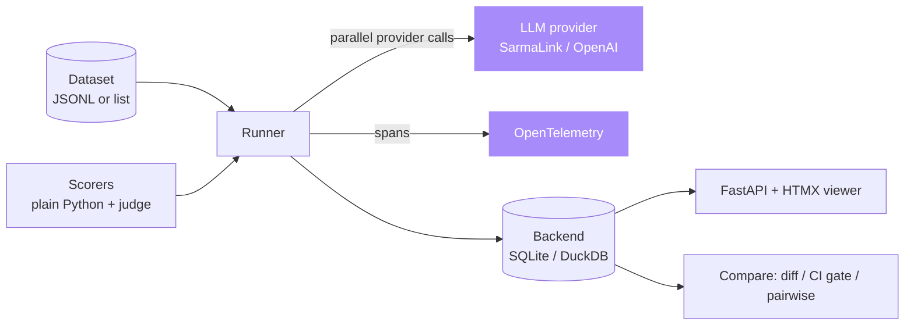

# ai-eval-runner

**Evals as code. Datasets, scorers, judges, regression gates and bootstrapped A/B in one Python CLI.**

[](LICENSE)
[](https://github.com/sarmakska/ai-eval-runner)
[](https://github.com/sarmakska/ai-eval-runner/commits/main)

ai-eval-runner is a self-hosted toolkit for evaluating LLM outputs the same way you test backend code. You write datasets as JSONL and scorers as plain Python functions, run them with one command, and store every result keyed by git SHA and dataset version. A built-in viewer shows per-example traces and a regression diff, a CI mode gates pull requests on score deltas, and a paired bootstrap tells you when one run genuinely beats another.

Built by [Sarma Linux](https://sarmalinux.com).

---

## Quickstart

```bash
git clone https://github.com/sarmakska/ai-eval-runner.git
cd ai-eval-runner
uv sync
cp .env.example .env                                  # set SARMALINK_API_KEY or OPENAI_API_KEY
uv run aieval run examples/summarisation/eval.py      # run the bundled example eval
```

Then start the viewer with `uv run aieval view` and open `http://localhost:8000`.

## What is in the box

- **CLI** (`aieval`) with `run`, `list`, `view`, `diff`, `ci` and `pairwise` commands.
- **Scorers** as plain Python functions, plus built-ins: `exact_match`, `json_valid`, `rouge_l`, `token_f1` (order-independent span overlap) and an `llm_judge` graded against a rubric, with optional self-consistency sampling.
- **Datasets** loaded from JSONL or built in-process, each given an order-independent content version, with a registry that records versions over time.
- **Regression diff** as a CLI command and a viewer route, showing per-scorer mean deltas and the examples that moved most.
- **CI gate** that compares a candidate run to a baseline and exits non-zero when any scorer regresses past a threshold.
- **Pairwise A/B** with a paired bootstrap, reporting a per-scorer confidence interval and declaring a winner only when the interval clears zero.
- **OpenTelemetry** attribute capture for runs and examples, behind an optional extra, following the GenAI semantic conventions.
- **Backends** for local SQLite and DuckDB, so runs persist with zero infrastructure.
- **Viewer** built on FastAPI and HTMX for browsing runs, traces and diffs.

## Writing an eval

An eval is a plain Python file. Decorate scorer functions with `@scorer`, point at a dataset, and call `run`. Built-in scorers and the LLM judge drop straight in.

```python
from aieval import dataset, run, scorer
from aieval.scorers import llm_judge, rouge_l


@scorer
def length_under_120_words(prediction: str, _expected: str) -> float:
    return 1.0 if len(prediction.split()) <= 120 else 0.0


faithful = llm_judge(
    rubric="Reward summaries faithful to the source that omit nothing important.",
    model="smart",
    name="faithfulness",
)


if __name__ == "__main__":
    run(
        name="summarisation",
        dataset=dataset.jsonl("examples/summarisation/dataset.jsonl"),
        scorers=[rouge_l, length_under_120_words, faithful],
        provider="sarmalink",
        model="smart",
    )
```

Run it with `uv run aieval run examples/summarisation/eval.py`. The runner handles parallel execution, retries, scoring, telemetry and storage.

### Built-in scorers

`token_f1` gives an order-independent span-overlap score, the harmonic mean of token precision and recall. It is more forgiving than `exact_match` for free-form answers and, unlike `rouge_l`, ignores word order, so a correct answer that reorders the reference is not penalised.

```python
from aieval.scorers import token_f1

token_f1("paris is the capital", "the capital is paris")  # 1.0, order ignored
```

A single LLM grade carries real variance. Pass `samples` to `llm_judge` to grade with self-consistency: the judge is queried that many times concurrently and the median verdict is taken, so one noisy grade cannot swing the score.

```python
from aieval.scorers import llm_judge

faithful = llm_judge(
    rubric="Reward summaries faithful to the source that omit nothing important.",
    samples=3,            # query three times, take the median verdict
    name="faithfulness",
)
```

## Comparing runs

```bash
uv run aieval list                       # find run ids
uv run aieval diff <run_a> <run_b>       # per-scorer deltas and the examples that moved
uv run aieval pairwise <run_a> <run_b>   # paired bootstrap with a 95% confidence interval
uv run aieval ci <run_id> --threshold 0.05   # gate a candidate; exits 1 on regression
```

## Architecture



See [ARCHITECTURE.md](ARCHITECTURE.md) for the full write-up.

## When to use this

- You ship prompt or model changes and want a repeatable eval suite instead of eyeballing samples.
- You want an eval gate in CI that fails a pull request when a scorer regresses past a threshold.
- You want to know whether a new model genuinely beats the old one, with a confidence interval rather than a single number.
- You want runs, scores, judges and traces in one self-hosted tool with no third-party platform and no vendor lock-in.

## When not to use this

- You need a hosted, multi-tenant evaluation platform with dashboards and team management out of the box.
- You only ever score a single example by hand and do not need persistence or regression tracking.
- Your evaluation is purely human review with no programmatic scoring.

## Documentation

Full architecture, real-world examples and troubleshooting live in the [wiki](https://github.com/sarmakska/ai-eval-runner/wiki). Change history is in [CHANGELOG.md](CHANGELOG.md) and the plan is in [ROADMAP.md](ROADMAP.md).

## License

MIT. See [LICENSE](LICENSE).

---

## More open source by Sarma

Part of a portfolio of production-shaped open-source repositories built and maintained by [Sarma](https://sarmalinux.com).

| Repository | What it is |
|---|---|
| [Sarmalink-ai](https://github.com/sarmakska/Sarmalink-ai) | Multi-provider OpenAI-compatible AI gateway with 14-engine failover and intent-based plugin auto-routing |
| [agent-orchestrator](https://github.com/sarmakska/agent-orchestrator) | Durable multi-agent workflows in TypeScript with deterministic replay and Inspector UI |
| [voice-agent-starter](https://github.com/sarmakska/voice-agent-starter) | Sub-second full-duplex voice agent loop. WebRTC, mediasoup, pluggable STT / LLM / TTS |
| [ai-eval-runner](https://github.com/sarmakska/ai-eval-runner) | Evals as code. Python, DuckDB, FastAPI viewer, regression mode for CI |
| [mcp-server-toolkit](https://github.com/sarmakska/mcp-server-toolkit) | Production Model Context Protocol server starter (Python / FastAPI) |
| [local-llm-router](https://github.com/sarmakska/local-llm-router) | OpenAI-compatible proxy that routes to Ollama or cloud providers based on policy |
| [rag-over-pdf](https://github.com/sarmakska/rag-over-pdf) | Minimal end-to-end RAG starter for PDF corpora |
| [receipt-scanner](https://github.com/sarmakska/receipt-scanner) | Vision OCR for receipts with Zod-validated JSON output |
| [webhook-to-email](https://github.com/sarmakska/webhook-to-email) | Webhook receiver that forwards events to email via Resend |
| [k8s-ops-toolkit](https://github.com/sarmakska/k8s-ops-toolkit) | Helm chart for shipping Next.js to Kubernetes with full observability stack |
| [terraform-stack](https://github.com/sarmakska/terraform-stack) | Vercel + Supabase + Cloudflare + DigitalOcean modules in one Terraform repo |
| [staff-portal](https://github.com/sarmakska/staff-portal) | Open-source HR / ops portal: leave, attendance, expenses, kiosk mode |

Engineering essays at [sarmalinux.com/blog](https://sarmalinux.com/blog) &middot; All projects at [sarmalinux.com/open-source](https://sarmalinux.com/open-source)
